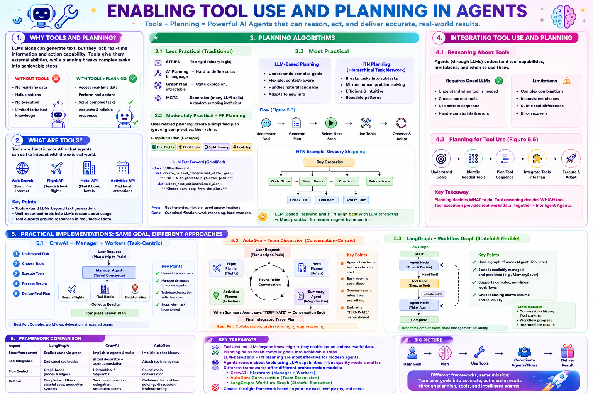

# 🚀 Enabling Tool Use and Planning in Agents



> A complete high-level revision guide for Tool Use, Planning, Tool Reasoning, HTN, LLM Planning, and Agent Frameworks.

---

# 🎯 Core Idea

Traditional LLMs can only generate text based on training data.

Agentic systems become powerful when they combine:

```text
LLM Reasoning
      +
Planning
      +
Tools
      =
Intelligent Agent
```

An agent can:

* Understand goals
* Create plans
* Use external tools
* Retrieve real-world information
* Execute actions
* Adapt to new information

---

# 1️⃣ Why Tools Matter

Without tools, an LLM:

```text
Can Think
Cannot Verify
Cannot Act
```

Example:

User:

> What's the weather today?

Without a weather tool:

```text
Hallucination
or
"I don't know"
```

With a weather API:

```text
Real-Time Weather
Accurate Response
```

Tools extend an agent beyond its training data.

---

# 2️⃣ What Is Tool Use?

Tool use means an agent can leverage external resources to enhance its capabilities.

Examples:

* APIs
* Databases
* Utility Functions
* External Services
* Hardware Devices

Instead of relying only on memory, agents can:

```text
Access Data
Perform Actions
Execute Workflows
```

---

# 3️⃣ Function Calling vs Tool Calling

## Function Calling

The LLM generates a structured call to an internal function.

Example:

```json
{
  "function": "get_user_profile",
  "parameters": {
    "user_id": 123
  }
}
```

Usually used for:

* Calculations
* Internal logic
* Database lookups

---

## Tool Calling

The LLM generates a structured request for an external system.

Example:

```json
{
  "function": "weather_lookup",
  "parameters": {
    "location": "Boston"
  }
}
```

Usually used for:

* APIs
* Web services
* External systems

---

# Important

The LLM NEVER executes the tool.

The LLM only says:

```text
Use This Tool
With These Inputs
```

Execution is performed by:

```text
Agent Controller
Runtime Environment
Framework
```

---

# 4️⃣ Tool Calling Flow

```text
User Request
      ↓
LLM Understands Intent
      ↓
Generate Tool Call
      ↓
Agent Controller Executes Tool
      ↓
Tool Returns Result
      ↓
LLM Uses Result
      ↓
Final Response
```

---

# 5️⃣ Defining Tools

Agents need tool descriptions.

The LLM understands tools through:

```text
Name
Description
Inputs
Outputs
```

Not through code.

---

## Framework Style (Docstrings)

```python
def weather_lookup(location):
    """
    Lookup real-time weather.
    """
```

Benefits:

* Easy to create
* Developer-friendly
* Used in CrewAI and LangGraph

---

## Direct API Style (JSON Schema)

```json
{
  "name": "weather_lookup",
  "description": "Lookup weather data",
  "input_schema": {
    "location": "string"
  }
}
```

Benefits:

* Explicit
* Standardized
* Required by many LLM APIs

---

# Key Lesson

Good tool descriptions improve:

```text
Tool Selection
Tool Reasoning
Tool Accuracy
```

---

# 6️⃣ Types of Tools

---

## API Tools

Access external services.

Examples:

* Weather APIs
* Flight APIs
* Hotel APIs
* Payment APIs

Purpose:

```text
Real-Time Information
```

---

## Database Tools

Store and retrieve data.

Examples:

* User Profiles
* Transaction History
* Knowledge Bases

Purpose:

```text
Persistent Memory
```

---

## Utility Functions

Local helper functions.

Examples:

* Calculations
* Data Processing
* Format Conversion

Purpose:

```text
Specialized Processing
```

---

## Integration Tools

Connect systems together.

Examples:

* Email
* Calendar
* Documents
* File Storage

Purpose:

```text
Workflow Automation
```

---

## Hardware Interface Tools

Connect to physical devices.

Examples:

* IoT Devices
* Sensors
* Robotics

Purpose:

```text
Physical World Interaction
```

---

# 7️⃣ Advanced Tool Concepts

---

## Tool Composition

Combining tools.

Example:

```text
Flight API
     ↓
Hotel API
     ↓
Itinerary Generator
```

Multiple tools create one workflow.

---

## Tool Selection

Agent decides:

```text
Which Tool?
When?
Why?
```

---

## Error Handling

If a tool fails:

```text
Retry
Fallback Tool
Alternative Method
```

---

## Tool State Management

Some tools maintain state.

Examples:

* Login Sessions
* API Tokens
* Database Connections

Agents must manage them properly.

---

## Tool Versioning

Tools evolve.

Agents must handle:

* New versions
* Deprecated features
* Compatibility

---

## Tool Security

Important considerations:

* Authentication
* Authorization
* Rate Limits
* Secure Access

---

# 8️⃣ Why Tools Are Important

Planning alone gives:

```text
What Should Be Done
```

Tools provide:

```text
Real Data
Real Actions
```

Example:

Travel Planning

Without tools:

```text
Fake Flights
Fake Hotels
```

With tools:

```text
Real Flights
Real Hotels
```

---

# 9️⃣ Planning in Agents

Planning means:

```text
Determining Steps
Required To Reach A Goal
```

---

General Flow:

```text
Goal
 ↓
Plan
 ↓
Actions
 ↓
Result
```

---

# 🔟 Planning Algorithms

---

## Less Practical

### STRIPS

Works with:

```text
True / False States
```

Problem:

Natural language is not binary.

---

### A*

Needs:

```text
Cost Function
Heuristic
```

Hard to define for conversations.

---

### GraphPlan

Builds action graphs.

Problem:

Language creates too many states.

---

### MCTS

Uses simulations.

Problem:

Too expensive with LLM calls.

---

# 1️⃣1️⃣ Moderately Practical: FF Planning

Fast Forward Planning

Idea:

```text
Create Simplified Plan
Ignore Complexities
Use As Guidance
```

Flow:

```text
Current State
      ↓
Relaxed Plan
      ↓
Choose Next Action
```

Advantages:

* Goal-oriented
* Fast
* Flexible

Disadvantages:

* Oversimplifies reality
* Weak state representation

---

# 1️⃣2️⃣ Most Practical: LLM-Based Planning

Modern agent systems primarily use this approach.

---

## How It Works

```text
Goal
 ↓
LLM Understands Context
 ↓
Generate Plan
 ↓
Execute Plan
 ↓
Adapt
```

---

Advantages:

* Flexible
* Handles ambiguity
* Natural language friendly
* Dynamic planning

---

Challenges:

* Can be overly optimistic
* Can miss constraints
* Requires good prompting

---

# 1️⃣3️⃣ HTN Planning

Hierarchical Task Network

Idea:

Break large tasks into smaller tasks.

---

Example:

```text
Buy Groceries
      ↓
Go To Store
Select Items
Checkout
Return Home
```

---

Further decomposition:

```text
Select Items
      ↓
Check List
Find Item
Add To Cart
```

---

Benefits:

* Mirrors human thinking
* Scalable
* Reusable
* Efficient

---

HTN Formula:

```text
Goal
 ↓
Subtasks
 ↓
Smaller Subtasks
 ↓
Executable Actions
```

---

# 1️⃣4️⃣ Integrating Planning and Tools

Planning decides:

```text
What To Do
```

Tool reasoning decides:

```text
Which Tool To Use
```

Tool execution provides:

```text
Real Data
```

---

Combined Flow:

```text
Goal
 ↓
Plan
 ↓
Choose Tool
 ↓
Execute Tool
 ↓
Observe Result
 ↓
Continue Plan
```

---

# 1️⃣5️⃣ Tool Reasoning

Modern LLMs naturally reason about tools.

They determine:

```text
Which Tool?
When?
Why?
In What Order?
```

---

Example:

Need Flights

```text
Use Flight Tool
```

Need Hotels

```text
Use Hotel Tool
```

Need Full Vacation

```text
Use Multiple Tools
```

---

# Common Failures

* Tool not used
* Wrong tool selected
* Wrong order
* Ignoring constraints
* Poor error recovery

---

# 1️⃣6️⃣ Planning For Tool Use

Modern planning is:

```text
Goal Understanding
       ↓
Task Breakdown
       ↓
Tool Selection
       ↓
Tool Sequencing
       ↓
Execution
       ↓
Adaptation
```

---

Example:

Family Vacation

```text
Understand Request
 ↓
Find Flights
 ↓
Find Hotels
 ↓
Find Activities
 ↓
Build Itinerary
```

Each task maps to specific tools.

---

# 1️⃣7️⃣ Practical Frameworks

All frameworks solve:

```text
User Goal
      ↓
Planning
      ↓
Tool Usage
      ↓
Execution
```

But use different orchestration methods.

---

# CrewAI

Philosophy:

```text
Manager + Workers
```

Flow:

```text
Task
 ↓
Manager
 ↓
Agents
 ↓
Tools
 ↓
Result
```

Best For:

* Delegation
* Hierarchical workflows
* Structured teams

---

# AutoGen

Philosophy:

```text
Team Discussion
```

Flow:

```text
Agent A
 ↔
Agent B
 ↔
Agent C
```

Round-robin conversations.

Best For:

* Collaboration
* Brainstorming
* Multi-agent discussions

---

# LangGraph

Philosophy:

```text
Workflow Graph
```

Flow:

```text
Agent Node
 ↓
Tool Node
 ↓
Agent Node
```

Best For:

* Stateful workflows
* Production systems
* Complex orchestration

---

# Framework Comparison

| Feature  | CrewAI            | AutoGen         | LangGraph       |
| -------- | ----------------- | --------------- | --------------- |
| Style    | Manager + Workers | Team Discussion | Workflow Graph  |
| Flow     | Hierarchical      | Round Robin     | Graph-Based     |
| State    | Agent Context     | Chat History    | Explicit State  |
| Best For | Delegation        | Collaboration   | Complex Systems |

---

# 1️⃣8️⃣ Big Picture

The entire chapter can be summarized as:

```text
User Goal
     ↓
LLM Understands Goal
     ↓
Planning
     ↓
Task Decomposition
     ↓
Tool Selection
     ↓
Tool Execution
     ↓
Observation
     ↓
Adaptation
     ↓
Final Result
```

---

# Final Takeaway

Modern AI agents are not powerful because of LLMs alone.

Their power comes from combining:

```text
Reasoning
+
Planning
+
Tools
+
Execution
+
Adaptation
```

Planning determines what should be done.

Tools provide real-world capabilities.

Together they transform an LLM into an intelligent agent capable of solving complex, multi-step problems in dynamic environments.
