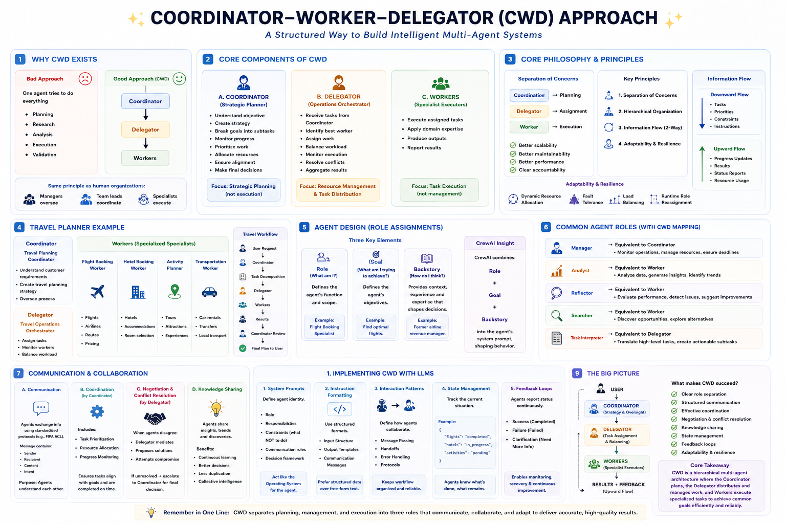

# 🧭 Chapter 6: Coordinator, Worker, and Delegator Approach



## 📖 Overview

This chapter explores the **Coordinator, Worker, and Delegator (CWD)** architectural pattern using **CrewAI** 🤖, a powerful framework for building multi-agent systems. This pattern is ideal for complex workflows where different specialized agents work together under coordination and delegation.

---

## 🏗️ Architecture Components

### 1. 🧠 Coordinator Agent
- Orchestrates the overall planning process
- Receives the initial user request and breaks it down into actionable steps
- Creates a comprehensive plan that outlines all necessary tasks
- Passes this plan to the Delegator for task assignment
- **Key Role:** Strategic planning and workflow orchestration

### 2. 📋 Delegator Agent
- Manages task distribution and assignment to specialized workers
- Acts as a project manager for the agent crew
- Ensures all workers have the necessary information and context
- Tracks progress and resolves bottlenecks
- **Key Role:** Task management and worker coordination

### 3. ⚙️ Worker Agents (Specialized)

The system includes four specialized worker agents:

| Worker | Responsibility | Tool Used |
|---|---|---|
| ✈️ **Flight Booking Specialist** | Searches for optimal flight options, considering cost, convenience, and traveler preferences | `search_flights` |
| 🏨 **Hotel Accommodation Expert** | Finds suitable hotels, balancing budget with amenity requirements | `find_hotels` |
| 🎟️ **Activities and Excursions Planner** | Curates personalized activities and day-by-day itineraries | `find_activities` |
| 🚌 **Local Transportation Coordinator** | Arranges transfers and local transit options | `find_transportation` |

---

## 🔄 Workflow Process

```
User Request
     │
     ▼
[Coordinator] → Creates Step-by-Step Plan
     │
     ▼
[Delegator] → Distributes Tasks to Workers
     │
     ▼
[Workers Execute Parallel Tasks]
     ├─ Flight Booking Specialist
     ├─ Hotel Accommodation Expert
     ├─ Activities Planner
     └─ Transportation Coordinator
     │
     ▼
[Consolidated Results] → Complete Travel Itinerary
```

---

## ✈️🗼 Real-World Example: Paris Anniversary Trip

### 🎯 Scenario

| Detail | Value |
|---|---|
| **Traveler** | Alex Johnson |
| **Destination** | Paris |
| **Duration** | 7 days |
| **Budget** | $300 total; Hotel under $400 with WiFi |
| **Preferences** | Direct flights (morning departure), moderate-paced activities with relaxation, mix of public transit and occasional taxis |

### 🧠 Coordinator's Planning Output

The coordinator breaks down the request into:

1. Flight booking from New York to Paris (5/7/2025 – 5/14/2025)
2. Hotel accommodation in Paris (mid-range, WiFi included)
3. Activity planning (moderate pace, romantic activities suitable for anniversary)
4. Local transportation setup (airport transfers, daily transit, evening taxis)

### 📋 Delegator's Task Assignment

The delegator assigns specific tasks to each worker with:
- Clear parameters and preferences
- Budget constraints
- Timeline requirements
- Quality expectations

### ⚙️ Worker Execution

| Worker | Result |
|---|---|
| ✈️ **Flight Worker** | Searches flights, filters by criteria, recommends Delta Airlines at $780 per person |
| 🏨 **Hotel Worker** | Finds accommodations, recommends Citadines Saint-Germain-des-Prés at $320 with WiFi |
| 🎟️ **Activity Worker** | Plans day-by-day activities including Eiffel Tower, Louvre, Seine cruise |
| 🚌 **Transportation Worker** | Recommends metro passes and specific taxi services |

---

## ⭐ Key Features

1. 🧩 **Specialization** — Each worker agent has specific expertise and access to relevant tools
2. 📈 **Scalability** — New worker agents can be easily added for additional tasks
3. ⚡ **Efficiency** — Tasks can be executed in parallel, reducing overall processing time
4. ✅ **Quality Control** — The coordinator ensures consistency and the delegator monitors quality
5. 🔧 **Flexibility** — The system handles complex, multi-step workflows dynamically

---

## 🛠️ CrewAI Implementation Details

### 🤖 Agent Configuration

```python
Agent(
    role="Specific Role",
    goal="Clear Objective",
    backstory="Context and Experience",
    tools=[relevant_tools],
    max_iter=1,
    max_retry_limit=3
)
```

### 📝 Task Definition

```python
Task(
    description="Detailed Task Description",
    agent=specific_agent,
    expected_output="Clear Expected Result"
)
```

### 👥 Crew Organization

- **Sequential Process** — For dependent tasks
- **Hierarchical Process** — For managed task distribution with a manager agent (delegator)

### 🧰 Tools Used

| Tool | Purpose |
|---|---|
| ✈️ `search_flights` | Searches available flights with pricing and schedules |
| 🏨 `find_hotels` | Searches accommodations with ratings and amenities |
| 🎟️ `find_activities` | Discovers attractions and experiences |
| 🚌 `find_transportation` | Identifies local transit options and passes |

---

## 🎯 Use Cases

This CWD pattern is ideal for:

- 🧳 **Travel Planning** — Complex multi-component booking
- 📊 **Project Management** — Breaking down large projects into subtasks
- 🎉 **Event Planning** — Coordinating vendors and services
- 🏢 **Business Operations** — Managing workflows across teams
- ✍️ **Content Creation** — Coordinating research, writing, and editing
- 💻 **Software Development** — Orchestrating different development phases

---

## 🚀 Advanced Concepts

### 🛡️ Error Handling
- Retry mechanisms built into each agent
- Maximum retry limits prevent infinite loops
- Fallback options when preferred choices are unavailable

### 🔄 Dynamic Planning
- Plans adjust based on real-time data
- Constraints are respected throughout execution
- Recommendations consider multiple factors

### 💬 Communication
- Clear handoff between coordinator and delegator
- Detailed task descriptions prevent misunderstandings
- Standardized output formats for easy integration

---

## 💎 Benefits of This Architecture

- 🔍 **Clarity** — Clear separation of concerns
- 🧱 **Maintainability** — Easy to update individual agent behaviors
- 🧪 **Testability** — Each agent can be tested independently
- 🧩 **Extensibility** — Simple to add new worker agents
- 🐛 **Debugging** — Issues can be traced to specific agents
- 📈 **Scalability** — Can handle workflows of any complexity

---

## ⚠️ Challenges and Solutions

| Challenge | Solution |
|---|---|
| Too many agents | Use hierarchical delegation |
| Task dependencies | Sequential process instead of parallel |
| Conflicting recommendations | Add coordinator review step |
| API rate limits | Implement caching and batching |
| Long execution times | Optimize tool calls and parallelization |

---

## 🏁 Conclusion

The Coordinator, Worker, and Delegator pattern provides a robust framework for building intelligent multi-agent systems. By combining specialized agents under a coordinated management structure, you can create systems that handle complex, real-world problems with efficiency and clarity. 🎯

This approach demonstrates how AI agents can work together, mirroring human team dynamics while maintaining the speed and consistency of automated systems.

---

## 🚦 Getting Started

To run the example:

1. 🔑 Set up your OpenAI API key
2. 📦 Install CrewAI and dependencies
3. ▶️ Run the `ch_6_main.ipynb` notebook
4. 🔧 Modify the travel request to test different scenarios

---

## 📚 References

- **Framework:** CrewAI
- **LLM:** GPT-4o and GPT-4o-mini
- **Pattern:** Multi-Agent Architecture
- **Paradigm:** Agentic AI Systems