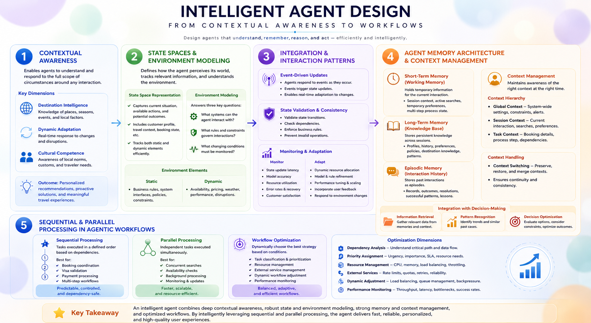

# 🤖 Effective Agentic System Design Techniques



A hands-on, notebook-driven walkthrough of how to design agentic AI systems that actually work — from writing sharp agent objectives to giving agents the right kind of memory.

---

## ✨ What's Inside

- 🎯 **Objectives that matter** — why the `goal` you give an agent (e.g. CrewAI's `Agent(goal=...)`) shapes everything it does
- 📝 **Task specifications done right** — the key ingredients of a task description that actually produces useful output
- 🪞 **Meta prompting** — using the LLM itself to critique and sharpen your objectives and tasks
- 🌍 **State spaces & environment modeling** — static vs. dynamic environments, and how they tie into memory
- 🧠 **Memory, the right way** — short-term (thread-scoped), long-term (memory collections), and episodic (learning from past wins)
- ⚡ **Sequential vs. parallel workflows** — when agents should work solo in a chain vs. collaborate side-by-side

## 📁 Files

| File | What it covers |
|---|---|
| `chapter_7_a.ipynb` | Objectives, task specifications, and meta prompting |
| `chapter_7_b.ipynb` | Environment modeling, memory types, and workflow patterns |
| `diagram.png` | The concept diagram shown above |

## 🛠️ Get Started

```bash
pip install crewai langchain-core langchain-openai langgraph langmem openai pydantic
```

You'll need an API key (e.g. `OPENAI_API_KEY`) — set it as an environment variable, or enter it via `getpass` when the notebook asks.

1. 📦 Install the requirements above
2. 🚀 Open the first notebook in Jupyter or VS Code
3. ▶️ Run the cells top to bottom, then move on to the second notebook
4. 🔑 Supply your API key when prompted

## 📚 Source

From [`Building-Agentic-AI-Systems---Create-Intelligent-Autonomus`](https://github.com/paras160500/Building-Agentic-AI-Systems---Create-Intelligent-Autonomus) by [paras160500](https://github.com/paras160500).